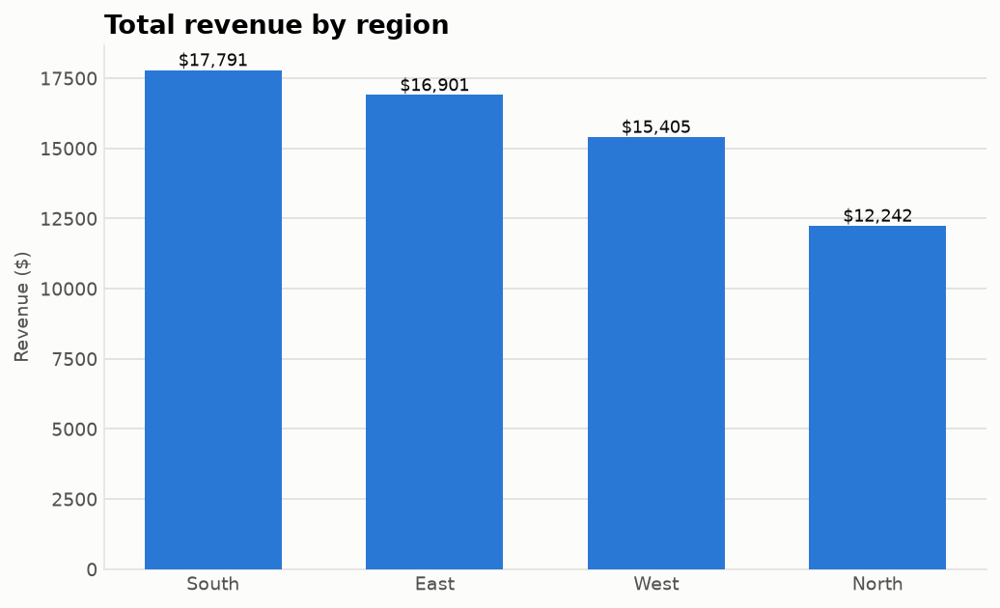
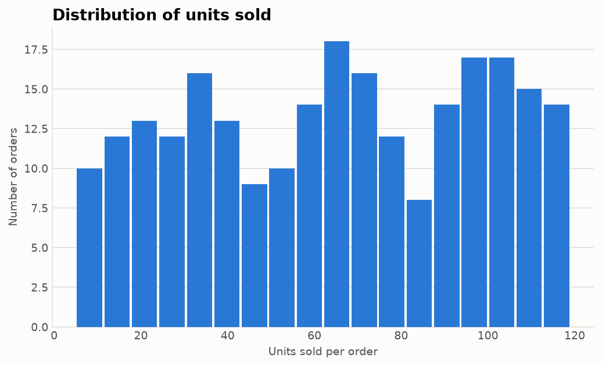
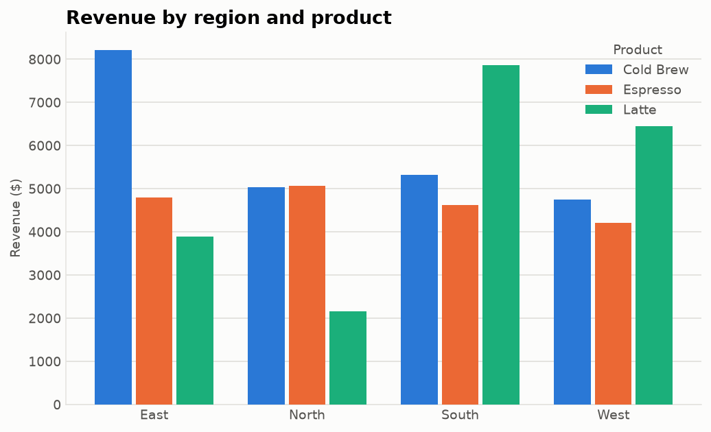
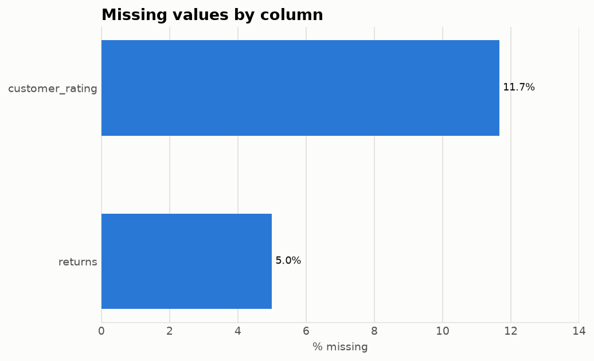

# communication

Lightweight helpers for **summarizing and understanding tabular data**. Point
it at a pandas `DataFrame` and get a fast, readable first look — which columns
are numeric, where the missing values are, and the key statistics for every
numeric field.

---

## ✨ Features

- 🔢 **`numeric_columns`** — list the numeric columns (booleans excluded)
- 🏷️ **`categorical_columns`** — list the non-numeric columns
- 🕳️ **`missing`** — per-column count and percentage of missing values
- 📊 **`summarize`** — descriptive statistics *plus* missing-value info in one table

All functions take a `pandas.DataFrame` and return plain pandas objects, so
results drop straight into the rest of your workflow.

---

## 🚀 Installation

Install directly from the repository:

```bash
pip install git+https://github.com/gursimratgrewal/communication-.git
```

Or clone and install in editable mode for development:

```bash
git clone https://github.com/gursimratgrewal/communication-.git
cd communication-
pip install -e ".[dev]"
```

Requires Python 3.9+ and pandas.

---

## 📖 Usage

```python
import pandas as pd
import communication as comm

df = pd.DataFrame({
    "age":    [25, 30, None, 45],
    "score":  [1.5, 2.5, 3.5, 4.5],
    "name":   ["a", "b", "c", None],
    "active": [True, False, True, True],
})

comm.numeric_columns(df)
# ['age', 'score']

comm.categorical_columns(df)
# ['name', 'active']

comm.missing(df)
#        count  percent
# age        1     25.0
# name       1     25.0
# score      0      0.0
# active     0      0.0

comm.summarize(df)
#        count  missing  missing_percent  mean  std  min  25%  50%  75%   max
# age        3        1             25.0  33.3  ...  25.0 ...  30.0 ...  45.0
# score      4        0              0.0   3.0  ...   1.5 ...   3.0 ...   4.5
```

---

## 📊 Sample dataset & visuals

A runnable demo lives in [`examples/demo.py`](examples/demo.py). It generates a
reproducible sample dataset ([`examples/sample_sales.csv`](examples/sample_sales.csv),
240 rows of coffee-shop sales), summarizes it with this package, and renders the
charts below:

```bash
pip install -e ".[examples]"
python examples/demo.py
```

| | |
| :---: | :---: |
|  |  |
|  |  |

The **missing values** chart is driven directly by `communication.missing()`,
and the printed summary comes from `communication.summarize()` — so the visuals
double as a demonstration of the API.

---

## 🧩 API

| Function                       | Returns            | Description                                                        |
| ------------------------------ | ------------------ | ------------------------------------------------------------------ |
| `numeric_columns(df)`          | `list[str]`        | Names of numeric columns (booleans excluded).                      |
| `categorical_columns(df)`      | `list[str]`        | Names of non-numeric columns (complement of the above).            |
| `missing(df)`                  | `DataFrame`        | `count` and `percent` missing per column, sorted worst-first.      |
| `summarize(df)`                | `DataFrame`        | Count, missing info, mean, std, min, quartiles and max per column. |

Passing anything other than a `DataFrame` raises `TypeError`.

---

## 🧪 Development

```bash
pip install -e ".[dev]"
pytest
```

---

## 🗺 Roadmap

- [x] `numeric_columns`, `categorical_columns`, `missing`, `summarize`
- [ ] Value-count / cardinality helpers for categorical columns
- [ ] Correlation and outlier summaries
- [ ] Optional plotting integration

---

## 🤝 Contributing

1. Fork the repository
2. Create a feature branch (`git checkout -b feature/my-feature`)
3. Add tests and make them pass with `pytest`
4. Open a pull request

---

## 📄 License

Released under the [MIT License](LICENSE).
